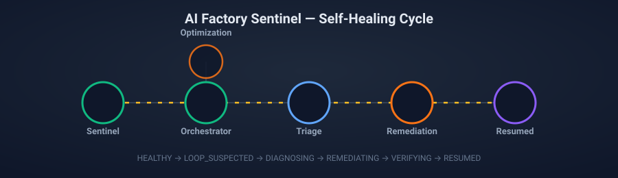
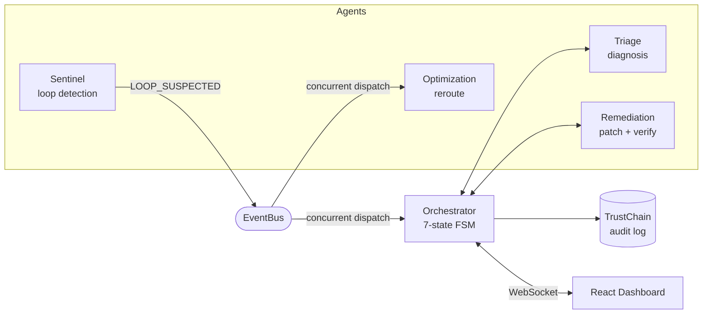

# AI Factory Sentinel

**A self-healing agentic workflow orchestrator.** When a worker in an AI
agent factory gets stuck in a loop — a schema change, a flaky
downstream service, a timeout — Sentinel detects it in under a second,
diagnoses the root cause, generates and verifies a patch, and reroutes
work around the failure, with zero human intervention. Every step is
backed by an independent fallback chain, so the system degrades
gracefully instead of crashing whenever a third-party service is
unavailable — which, on a zero-budget free-tier stack, is often.



[](LICENSE)
[](backend)
[](dashboard)

---

## Table of contents

- [What this actually is](#what-this-actually-is)
- [Architecture](#architecture)
- [How a healing cycle works](#how-a-healing-cycle-works)
- [Fallback chains](#fallback-chains)
- [Tech stack](#tech-stack)
- [Getting started](#getting-started)
- [Project structure](#project-structure)
- [API reference](#api-reference)
- [Testing](#testing)
- [Team](#team)
- [Known limitations & deliberate scope decisions](#known-limitations--deliberate-scope-decisions)
- [Future work](#future-work)
- [License](#license)

---

## What this actually is

Four independent async agents — **Sentinel** (loop detection), **Triage**
(root-cause diagnosis), **Remediation** (patch generation + sandboxed
verification), and **Optimization** (workload rerouting) — coordinated
by an **Orchestrator** running a 7-state finite-state machine, all
publishing onto one shared **event bus**. Every state transition is
written to an append-only, SHA-256 hash-chained audit log, so the
entire healing history is tamper-evident.

Built by a 4-person team over 15 days as a Phase 1 milestone, on
entirely free-tier infrastructure across physically separate machines
connected over LAN — no shared cloud account, no paid API tier.

## Architecture



Full diagrams — the FSM transition table, the end-to-end sequence
diagram, all 4 fallback chains, and the dashboard's data flow — are in
**[`docs/architecture.md`](docs/architecture.md)**.

## How a healing cycle works

1. **Detect** — Sentinel embeds each worker's output and compares
   cosine similarity across a sliding window. Similarity > 0.92 for 3
   consecutive steps *and* a repeated error signature → `LOOP_SUSPECTED`.
2. **Diagnose** — Triage sends the recent logs to an LLM constrained to
   a 6-value `fix_type` enum, returning root cause, affected field, and
   a confidence score.
3. **Decide** — confidence ≥ 0.7 → attempt remediation. Below that →
   escalate to a human immediately. No retry loop, no guessing.
4. **Remediate** — Remediation generates a targeted patch and calls a
   sandboxed verification service. Verified → `RESUMED`. Not verified →
   `ESCALATED`.
5. **Reroute** (concurrently with steps 2-4) — Optimization solves a
   constrained assignment problem excluding the failing worker, so
   throughput doesn't collapse while healing happens.
6. **Report** — a Post-Heal Report Card shows real, computed metrics:
   time to detect, tokens saved by caching, throughput maintained,
   fixes applied, escalations, fallbacks triggered.

## Fallback chains

The core resilience pattern, repeated independently for every external
dependency:

| Agent | Primary | Fallback 1 | Fallback 2 |
|---|---|---|---|
| Sentinel (embeddings) | NVIDIA NIM | sentence-transformers (local) | SHA-256 hash exact-match |
| Triage (diagnosis) | Nemotron | Groq Llama 3.3 70B | Rule-based heuristic |
| Optimization (reroute) | ~~cuOpt~~ *(skipped — see below)* | OR-Tools ILP solver | Greedy round-robin |
| Remediation (verify) | NemoClaw CLI (real sandbox) | Mock wrapper | Escalate to human |

Every fallback transition is visible live on the dashboard — a pulsing
halo, a static ring, or a badge, depending on which agent and which
source — not just logged silently.

## Tech stack

**Backend:** Python 3.14, FastAPI, asyncio, httpx, OR-Tools,
sentence-transformers, WebSockets.
**Dashboard:** React 19, Vite, TypeScript, Tailwind CSS, Zustand,
Framer Motion, React Flow, Recharts.
**Wrapper:** FastAPI, mode-switches between a real NemoClaw CLI adapter
and a mock simulator with an identical HTTP contract.
**Infra:** Docker Compose, 3 services (backend, wrapper, dashboard),
gated behind a `full-stack` profile.

## Getting started

### Full stack via Docker Compose

```bash
docker compose --profile full-stack up --build
```

- Backend → `http://localhost:8000`
- Wrapper → `http://localhost:8081`
- Dashboard → `http://localhost:3000`

First build downloads a local embedding model and ML dependencies —
budget ~10 minutes on a clean machine. Needs an `ENV_FILE` pointing at
your own API keys (`person1.env` is the default; copy `.env.example`
and fill in your own `NVIDIA_NIM_API_KEY` / `GROQ_API_KEY` — never
commit real keys, the `*.env` pattern is gitignored for exactly this
reason).

### Dashboard only (against a remote or local backend)

```bash
cd dashboard
npm install
npm run dev
```

See **[`dashboard/README.md`](dashboard/README.md)** for environment
variables, component architecture, and troubleshooting.

### Backend only, without Docker

```bash
cd backend
python -m venv .venv && source .venv/bin/activate
pip install -r requirements.txt
uvicorn api.main:app --reload
```

## Project structure

```
.
├── backend/            FastAPI app: agents, orchestrator, event bus, audit log, metrics
│   ├── sentinel/        Agent implementations, fallback chains, caches, circuit breakers
│   ├── api/             HTTP + WebSocket routes
│   └── tests/           pytest suite (100+ tests)
├── wrapper/             Mock/real NemoClaw CLI adapter service
├── dashboard/            React control-plane UI
├── docs/                 Architecture, API reference, contracts, verification scripts' output
├── scripts/              Standalone ops scripts (audit chain verification, pre-demo checks)
└── docker-compose.yml    3-service deployment
```

## API reference

Full request/response examples for every endpoint — backend, wrapper,
and the WebSocket envelope schema — are in
**[`docs/api_reference.md`](docs/api_reference.md)**.

| Endpoint | Purpose |
|---|---|
| `GET /health` | Backend liveness |
| `POST /demo/inject` | Inject one of 4 fault types, drives the real pipeline |
| `GET /api/metrics` | Post-Heal Report Card data |
| `GET /api/circuit-status` | Per-service circuit breaker state |
| `WS /ws/stream` | Live state/audit/sandbox event stream |
| `GET /v1/status`, `POST /v1/remediate` | Wrapper service (mock/real NemoClaw) |

## Testing

```bash
# Backend
cd backend && source .venv/bin/activate && python -m pytest -q

# Dashboard
cd dashboard && npm run build && npm run lint

# Ops scripts
python scripts/verify_audit_chain.py
python scripts/pre_demo_check.py
```

## Team

| Person | Role |
|---|---|
| Nipun | SDK Lead & Fallback Architect |
| Rashi | Algorithms & Optimization |
| Shreshtha | Infrastructure & NemoClaw Specialist |
| Tushar | Control Plane Interface |

Detailed component-level docs and resume bullets per person:
[`docs/resume_bullets.md`](docs/resume_bullets.md).

## Known limitations & deliberate scope decisions

Documented honestly rather than glossed over — see
[`docs/api_contracts.md`](docs/api_contracts.md) for the full history
of every finding across all 15 days:

- **cuOpt is skipped project-wide.** Hosted API access was never
  confirmed working during Phase 1 (no stable endpoint found). OR-Tools
  — always intended as cuOpt's own fallback — is the practical primary
  solver instead. Not a missing feature; a documented, honest scope
  adjustment.
- **In-memory only.** Caches, circuit breakers, and token counters
  reset on process restart. Fine for a single-demo-run system; not
  production-durable.
- **Single-process by design.** The backend deliberately runs with one
  uvicorn worker — several agents hold in-memory singleton state
  (circuit breakers, caches) that multiple worker *processes* would
  silently fork into inconsistent copies.

## Future work

Phase 2, not started — real gaps found during Phase 1 testing,
intentionally deferred rather than rushed in before demo day:

- **Async LLM/embedding clients.** `TriageAgent`, `SentinelAgent`'s
  external calls are currently synchronous `httpx` calls inside async
  code — a slow real API response blocks the whole event loop. Fine
  for a single-fault demo; a real concern under real concurrent load.
- **Lazy-load the sentence-transformers fallback model.** It currently
  loads eagerly at process startup, meaning the backend's ability to
  even boot depends on reaching HuggingFace — undermining the point of
  a *fallback* model needing the same network reachability as the
  primary just to exist.
- **A persistent, live throughput counter on the dashboard.** The demo
  narrative describes one (100% → 71% → 97%) but it only currently
  renders inside the final Post-Heal Report Card. The data already
  exists (`GET /api/metrics`) — just needs a standalone UI element.
- **Dashboard component test suite.** Backend has 100+ pytest tests;
  the dashboard has none yet beyond type-checking and linting.
- **Persistence layer.** A real database (or at minimum a durable
  file store with rotation) for the audit log and caches, instead of
  in-memory state and a single growing JSONL file.
- **Kubernetes deployment, authentication/OAuth2, observability
  (metrics/tracing), and a CI/CD pipeline** — explicitly out of scope
  for this 15-day Phase 1 sprint, planned for Phase 2.
- **Real cuOpt integration**, if/when hosted API access is confirmed
  reliably available — the fallback-first design means this can slot
  in without changing any calling code.

## License

[MIT](LICENSE)
