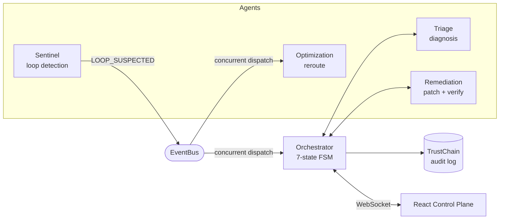

# NeuralGuard

**A self-healing agentic workflow orchestrator.** When a worker in an AI
agent factory gets stuck in a loop — a schema change, a flaky
downstream service, a timeout — NeuralGuard detects it in under a
second, diagnoses the root cause, generates and verifies a patch, and
reroutes work around the failure, with zero human intervention. Every
step is backed by an independent fallback chain, so the system degrades
gracefully instead of crashing whenever a third-party service is
unavailable, and every state transition is written to a SHA-256
hash-chained audit log — the entire healing history is tamper-evident.

The control-plane frontend is a 6-page site — a marketing/case-study
front end plus a live control room — built around a from-scratch
TypeScript port of the whole orchestration core, so the deployed site is
genuinely explorable with **no backend required**: kill a service,
inject a fault, and watch a real healing cycle run in the browser.

[](LICENSE)
[](backend)
[](dashboard)

---

## Table of contents

- [What this actually is](#what-this-actually-is)
- [The frontend](#the-frontend)
- [Architecture](#architecture)
- [How a healing cycle works](#how-a-healing-cycle-works)
- [Fallback chains](#fallback-chains)
- [Tech stack](#tech-stack)
- [Getting started](#getting-started)
- [Project structure](#project-structure)
- [API reference](#api-reference)
- [Testing](#testing)
- [Team](#team)
- [Known limitations & deliberate scope decisions](#known-limitations--deliberate-scope-decisions)
- [Future work](#future-work)
- [License](#license)

---

## What this actually is

Four independent async agents — **Sentinel** (loop detection), **Triage**
(root-cause diagnosis), **Remediation** (patch generation + sandboxed
verification), and **Optimization** (workload rerouting) — coordinated
by an **Orchestrator** running a 7-state finite-state machine, all
publishing onto one shared **event bus**. Every state transition is
written to an append-only, SHA-256 hash-chained audit log, so the
entire healing history is tamper-evident — mutate one record and every
hash after it fails verification.

Built end-to-end by two engineers, entirely on free-tier infrastructure
across physically separate machines connected over LAN — no shared
cloud account, no paid API tier.

## The frontend

`dashboard/` is a multi-page React 19 + TypeScript site, not a single
debugging panel:

| Route | Purpose |
|---|---|
| `/` | Landing — the product, the problem it solves, and a taste of the architecture |
| `/how-it-works` | The full 6-step healing cycle |
| `/architecture` | The FSM transition table, the audit chain (live, tamperable demo), the fallback matrix, the stack |
| `/fallbacks` | Fully interactive — kill a real service, inject a fault, watch the fallback ladder degrade live |
| `/dashboard` | The Control Plane — the real cinematic, real-time control room |
| `/about` | The team, and every deliberate scope decision, stated plainly |

The centerpiece is `dashboard/src/sim/` — a faithful TypeScript port of
the backend's orchestration core (the FSM, the event bus, a real
Web-Crypto SHA-256 hash chain, real circuit breakers, and all 4 agents'
decision logic). A `DataSource` abstraction (`dashboard/src/data/`)
means every panel in the Control Plane talks to exactly one connection,
whichever is live — a real backend when one is reachable, this
in-browser simulator otherwise — so the deployed site works standalone.

## Architecture



Full diagrams — the FSM transition table, the end-to-end sequence
diagram, all 4 fallback chains — are in
**[`docs/architecture.md`](docs/architecture.md)**, and rendered live
(read directly from the real transition map, not hand-copied) on
**[`/architecture`](dashboard/src/pages/Architecture.tsx)**.

## How a healing cycle works

1. **Detect** — Sentinel embeds each worker's output and compares
   cosine similarity across a sliding window. Similarity > 0.92 for 3
   consecutive steps *and* a repeated error signature → `LOOP_SUSPECTED`.
2. **Diagnose** — Triage sends the recent logs to an LLM constrained to
   a 6-value `fix_type` enum, returning root cause, affected field, and
   a confidence score.
3. **Decide** — confidence ≥ 0.7 → attempt remediation. Below that →
   escalate to a human immediately. No retry loop, no guessing.
4. **Remediate** — Remediation generates a targeted patch and calls a
   sandboxed verification service. Verified → `RESUMED`. Not verified →
   `ESCALATED`.
5. **Reroute** (concurrently with steps 2-4) — Optimization solves a
   constrained assignment problem excluding the failing worker, so
   throughput doesn't collapse while healing happens.
6. **Report** — a Post-Heal Report Card shows real, computed metrics:
   time to detect, tokens saved by caching, throughput maintained,
   fixes applied, escalations, fallbacks triggered.

## Fallback chains

The core resilience pattern, repeated independently for every external
dependency:

| Agent | Primary | Fallback 1 | Fallback 2 |
|---|---|---|---|
| Sentinel (embeddings) | NVIDIA NIM | sentence-transformers (local) | SHA-256 hash exact-match |
| Triage (diagnosis) | Nemotron | Groq Llama 3.3 70B | Rule-based heuristic |
| Optimization (reroute) | ~~cuOpt~~ *(skipped — see below)* | OR-Tools ILP solver | Greedy round-robin |
| Remediation (verify) | NemoClaw CLI (real sandbox) | Mock wrapper | Escalate to human |

Every fallback transition is visible live on the dashboard — a pulsing
halo, a static ring, or a badge, depending on which agent and which
source — not just logged silently. Try it interactively, live, with no
backend, on **[`/fallbacks`](dashboard/src/pages/Fallbacks.tsx)**.

## Tech stack

**Backend:** Python 3.14, FastAPI, asyncio, httpx, OR-Tools,
sentence-transformers, WebSockets.
**Dashboard:** React 19, Vite, TypeScript, Tailwind CSS v4, Zustand,
Framer Motion, GSAP, React Flow, Recharts.
**Simulator:** A from-scratch TypeScript port of the orchestration core
— real FSM legality, a real Web Crypto SHA-256 hash chain, real circuit
breaker state machines.
**Wrapper:** FastAPI, mode-switches between a real NemoClaw CLI adapter
and a mock simulator with an identical HTTP contract.
**Infra:** Docker Compose, 3 services (backend, wrapper, dashboard),
gated behind a `full-stack` profile.

## Getting started

### Full stack via Docker Compose

```bash
docker compose --profile full-stack up --build
```

- Backend → `http://localhost:8000`
- Wrapper → `http://localhost:8081`
- Dashboard → `http://localhost:3000`

First build downloads a local embedding model and ML dependencies —
budget ~10 minutes on a clean machine. Needs an `ENV_FILE` pointing at
your own API keys (copy `.env.example` and fill in your own
`NVIDIA_NIM_API_KEY` / `GROQ_API_KEY` — never commit real keys, the
`*.env` pattern is gitignored for exactly this reason).

### Dashboard only — fully standalone, no backend needed

```bash
cd dashboard
npm install
npm run dev        # starts on :3000, running the in-browser simulator
```

Point `VITE_WS_URL` / `VITE_BACKEND_URL` at a real backend to connect
live instead — see **[`dashboard/README.md`](dashboard/README.md)**.

### Backend only, without Docker

```bash
cd backend
python -m venv .venv && source .venv/bin/activate
pip install -r requirements.txt
uvicorn api.main:app --reload
```

## Project structure

```
.
├── backend/             FastAPI app: agents, orchestrator, event bus, audit log, metrics
│   ├── sentinel/          Agent implementations, fallback chains, caches, circuit breakers
│   ├── api/               HTTP + WebSocket routes
│   └── tests/             pytest suite (100+ tests)
├── wrapper/              Mock/real NemoClaw CLI adapter service
├── dashboard/            React control-plane site — 6 routes + in-browser simulator
│   └── src/
│       ├── pages/          Landing, How It Works, Architecture, Fallbacks, Control Plane, About
│       ├── sim/             TypeScript port of the orchestration core
│       ├── data/            DataSource abstraction — live backend or simulator, one connection
│       ├── store/           Single Zustand store, single envelope-ingestion point
│       └── components/      primitives/, viz/, panels/, marketing/
├── docs/                  Architecture, API reference, contracts, verification scripts' output
├── scripts/               Standalone ops scripts (audit chain verification, pre-demo checks)
└── docker-compose.yml     3-service deployment
```

## API reference

Full request/response examples for every endpoint — backend, wrapper,
and the WebSocket envelope schema — are in
**[`docs/api_reference.md`](docs/api_reference.md)**.

| Endpoint | Purpose |
|---|---|
| `GET /health` | Backend liveness |
| `POST /demo/inject` | Inject one of 4 fault types, drives the real pipeline |
| `GET /api/metrics` | Post-Heal Report Card data |
| `GET /api/circuit-status` | Per-service circuit breaker state |
| `GET /api/audit-log?limit=N` | Replay the persisted audit trail (survives a page refresh) |
| `WS /ws/stream` | Live state/audit/similarity/sandbox event stream |
| `GET /v1/status`, `POST /v1/remediate` | Wrapper service (mock/real NemoClaw) |

## Testing

```bash
# Backend
cd backend && source .venv/bin/activate && python -m pytest -q

# Dashboard
cd dashboard && npm run build && npm run lint

# Ops scripts
python scripts/verify_audit_chain.py
python scripts/pre_demo_check.py
```

## Team

| Person | Role |
|---|---|
| Nipun | Agent Intelligence & Resilience — the four autonomous agents, loop detection, LLM diagnosis, constrained-assignment rerouting, and the 3-tier fallback architecture |
| Shreshtha | Orchestration, Infrastructure & Control Plane — the FSM orchestrator, the event bus, the TrustChain audit log, the wrapper service, and the entire React control-plane site |

## Known limitations & deliberate scope decisions

Documented honestly rather than glossed over — see
[`docs/api_contracts.md`](docs/api_contracts.md) for the fuller history:

- **cuOpt is skipped project-wide.** Hosted API access was never
  confirmed working (no stable endpoint found). OR-Tools — always
  intended as cuOpt's own fallback — is the practical primary solver
  instead. Not a missing feature; a documented, honest scope adjustment.
- **In-memory only.** Caches, circuit breakers, and token counters
  reset on process restart. Fine for a single-session demo system; not
  production-durable.
- **Single-process by design.** The backend deliberately runs with one
  uvicorn worker — several agents hold in-memory singleton state
  (circuit breakers, caches) that multiple worker *processes* would
  silently fork into inconsistent copies.
- **The in-browser simulator approximates two things honestly.** It
  cannot call NVIDIA NIM/Nemotron or Groq directly (that would mean
  shipping API keys client-side, which the real backend correctly never
  does) — the two LLM-diagnosis tiers run the same real regex-based
  extraction as the rule-based heuristic, presented at the confidence
  and phrasing an LLM tier would produce. OR-Tools' CBC solver is
  substituted with a real, exact brute-force/greedy assignment solver
  (genuinely solving the same objective, not a stand-in number). Every
  other piece — the FSM, the event bus, the SHA-256 hash chain, the
  circuit breakers, the fallback ladder itself — is a full, unmocked
  port.

## Future work

Real gaps found during development, intentionally deferred rather than
rushed in:

- **Async LLM/embedding clients.** `TriageAgent`, `SentinelAgent`'s
  external calls are currently synchronous `httpx` calls inside async
  code — a slow real API response blocks the whole event loop.
- **Lazy-load the sentence-transformers fallback model.** It currently
  loads eagerly at process startup, meaning the backend's ability to
  even boot depends on reaching HuggingFace — undermining the point of
  a *fallback* model needing the same network reachability as the
  primary just to exist.
- **Dashboard component test suite.** Backend has 100+ pytest tests;
  the dashboard has a Vitest suite covering the simulator's core logic
  but not yet full component coverage.
- **Persistence layer.** A real database (or at minimum a durable file
  store with rotation) for the audit log and caches, instead of
  in-memory state and a single growing JSONL file.
- **Kubernetes deployment, authentication/OAuth2, observability
  (metrics/tracing), and a CI/CD pipeline** — explicitly out of scope
  for now.
- **Real cuOpt integration**, if/when hosted API access is confirmed
  reliably available — the fallback-first design means this can slot in
  without changing any calling code.

## License

[MIT](LICENSE)
