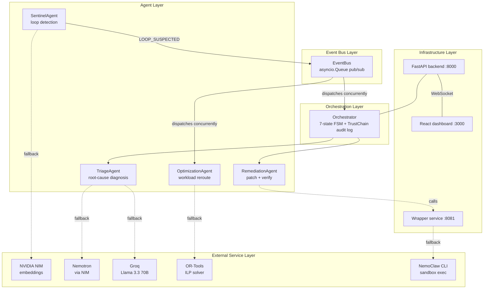
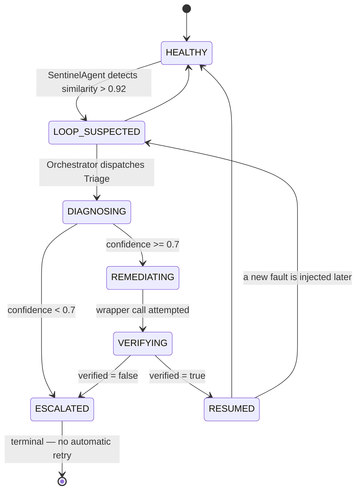
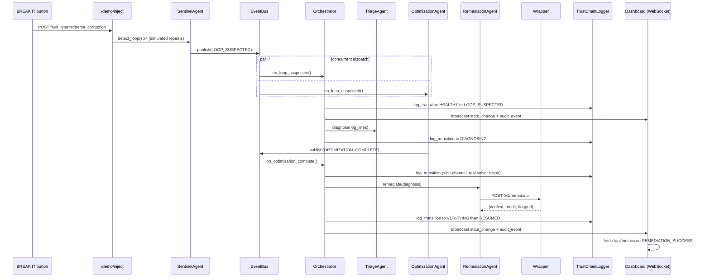
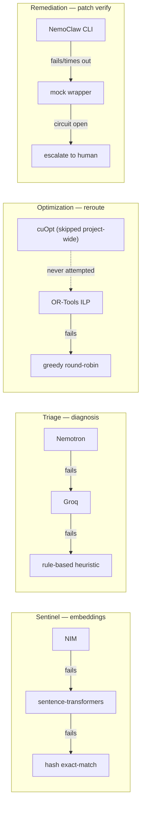
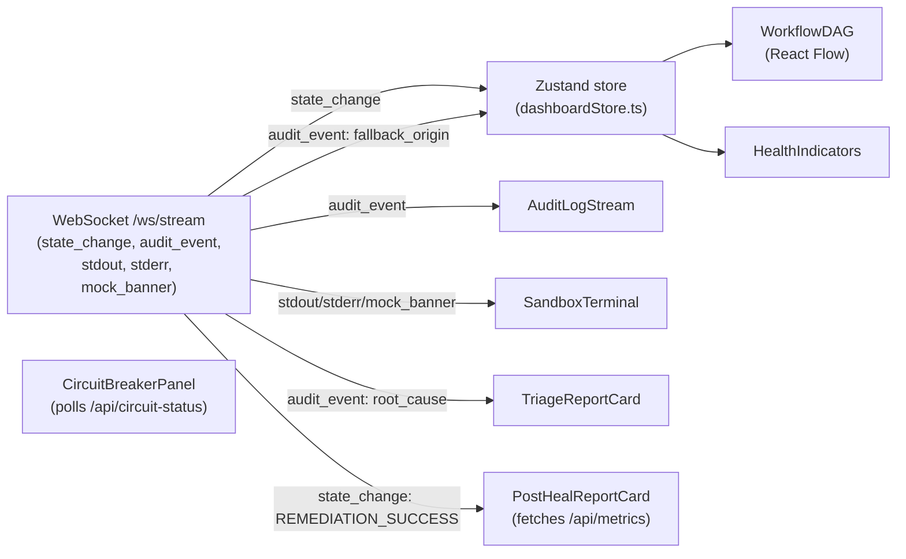
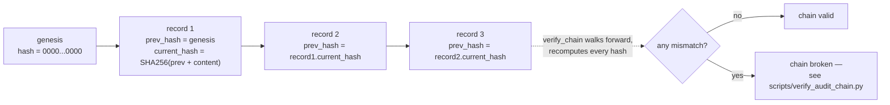

# Architecture

Every diagram below reflects the actual implemented code — the FSM
transition table, the fallback chains, the real endpoint shapes — not
an idealized version of the design. Where the diagrams and the code
could ever drift, the code wins; these are generated by hand against
`orchestrator.py`'s `VALID_TRANSITIONS`, each agent's real fallback
`try`/`except` chain, and the dashboard's real Zustand store, not
copied from planning documents.

## 1. System layers

## 2. Healing workflow — the FSM

`sentinel/agents/orchestrator.py`'s `VALID_TRANSITIONS` table, drawn
exactly (including the two paths most diagrams simplify away: a
worker can heal itself back to `HEALTHY` without ever looping, and
`RESUMED` can loop again later — `ESCALATED` is the only truly
terminal state, by design, since it means a human needs to look at it).

## 3. End-to-end sequence — one healing cycle

## 4. Fallback chains

Every agent has its own independent fallback chain — this is the
core resilience pattern the whole project is built around. Each one
is a real `try`/`except` cascade in the code, not a conceptual diagram.

**Why cuOpt shows as "never attempted," not "failing":** hosted cuOpt
API access was never confirmed working during Phase 1 (no stable public
endpoint, `HTTP 000` on every attempted call) — this was a deliberate,
documented scope decision from Day 4-5, not a gap. OR-Tools was always
the intended fallback *for* cuOpt, so it's now the practical primary
solver. See `docs/api_contracts.md`'s "Optimization Agent — Solver
Status" section for the full history.

## 5. Dashboard data flow

## 6. Audit log hash chain

Every state transition is a hash-chained, append-only JSONL record —
tampering any line breaks verification for every record after it.

